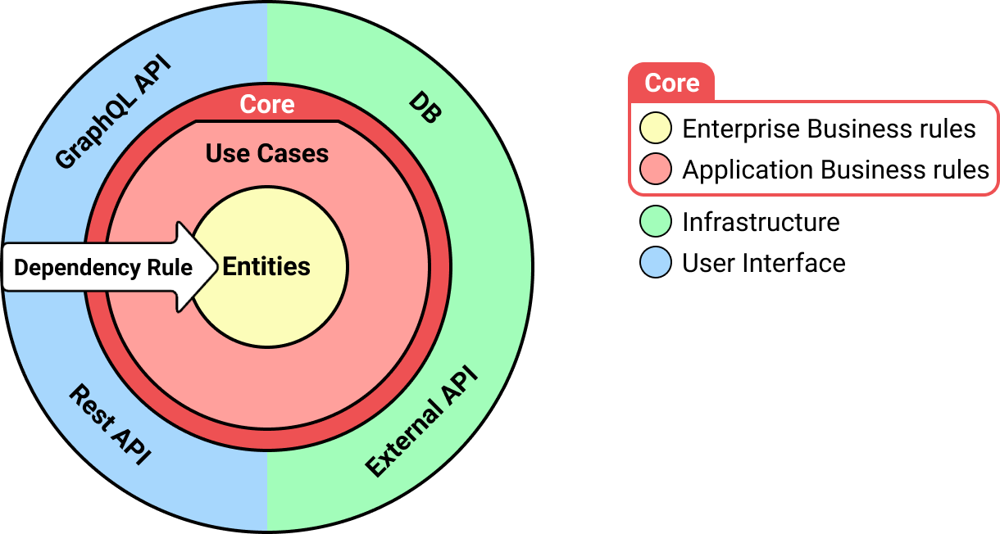

# Lightspeed Subscriptions challenge

The Subscription module is a service built on top of Lightspeed applications (Retail POS) that allows merchants to sell recurring items.

We're using a Clean Architecture organization. It allows us to focus on the core responsability of the service and not mixing concerns.



## 1 - Technical Test

_Setup the app_

```
npm i
npm run start:dev
```

You can access the Swagger interface on the following URL
`http://localhost:3000/api/#/`

### A) Failing Spec

- We recently pushed some modifications to our code and one of our tests is failing ... 🤦 Please fix it 🙏

- To run the test command: `npm run test`

### B) Integrate with another provider

- We've received the request to integrate our service to the Ecom API (see `src/___mocks___` directory).
  Our implementation currently only allows a single integration: the Retail API integration.
- **Explain your strategy** and start to write the required modifications to support this flow.

- Feel free to add new or update some existing specs as you see fit

## 2 - Open Questions
